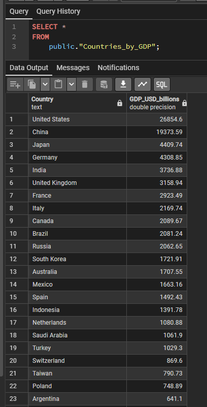

## Project Overview

This project demonstrates a simple ETL (Extract, Transform, Load) pipeline built with Python and Docker.
It consists of:

- A [Python ETL](https://github.com/chik0di/cde-bootcamp/blob/main/docker-etl/scrape.py) container that runs the extraction, transformation, and loading steps.

- A PostgreSQL database container that stores the processed data.

- A Dockerfile that builds the images and creates the network that connects both containers.

- A bash script (run.sh) that automates the full workflow.

## Project Structure
```
docker-etl/
│── .dockerignore         # Files ignored by Docker build
│── .env                  # Environment variables (DB credentials, etc.)
│── .gitignore            # Git ignore rules
│── Dockerfile            # Builds the Python ETL container
│── requirements.txt      # Python dependencies
│── run.sh                # Bash script to automate ETL pipeline
│── scrape.py             # Python ETL script
│── doc.MD                # Documentation / Notes
```

## Technologies Used

- Python 3.9+
- PostgreSQL (Dockerized)
- Docker 
- Bash scripting


## Confirmation
I interacted with the `scraper-db` container via the `-it` flag and confirmed that the tables were properly stored in the `scraper-db` database on postgres.
```
docker exec -it scraper-db psql -U postgres -d scraperdb
``` 

When I confirmed that it was all working, all that was left was to clear my history and replicate all these steps in a bash script [run.sh]()


## Additional steps: (not part of the assignment)
Having interacted with the database in the shell, i needed somewhere visual (to help me learn more) so I ran PgAdmin image - within the same network as the `scraper-etl` and `postgres` containers, `scraper-net`:
```
docker run -d --name pgadmin --network scraper-net -e PGADMIN_DEFAULT_EMAIL=admin@admin.com -e PGADMIN_DEFAULT_PASSWORD=admin -p 8080:80 dpage/pgadmin4:latest
```

It spun up a container and I accessed the `http://localhost:8080`, logged in and added a server whose host is the container name of the postgres database (because pgAdmin is on the same Docker network). Username and password should also align with your details in the postgres db. 



## Future Improvements
- Add conditional statements to confirm if container is already running.