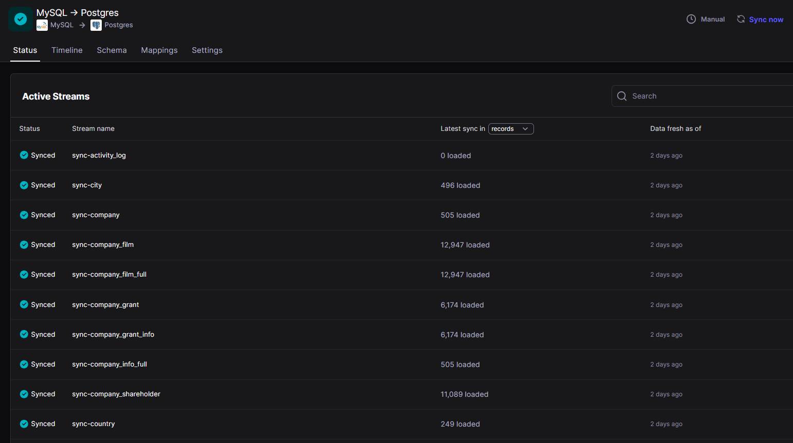
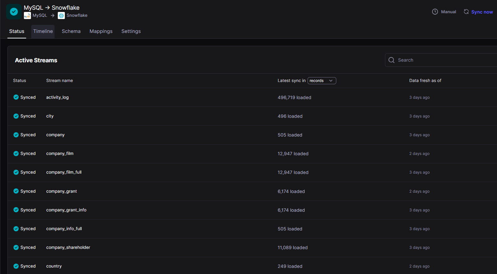
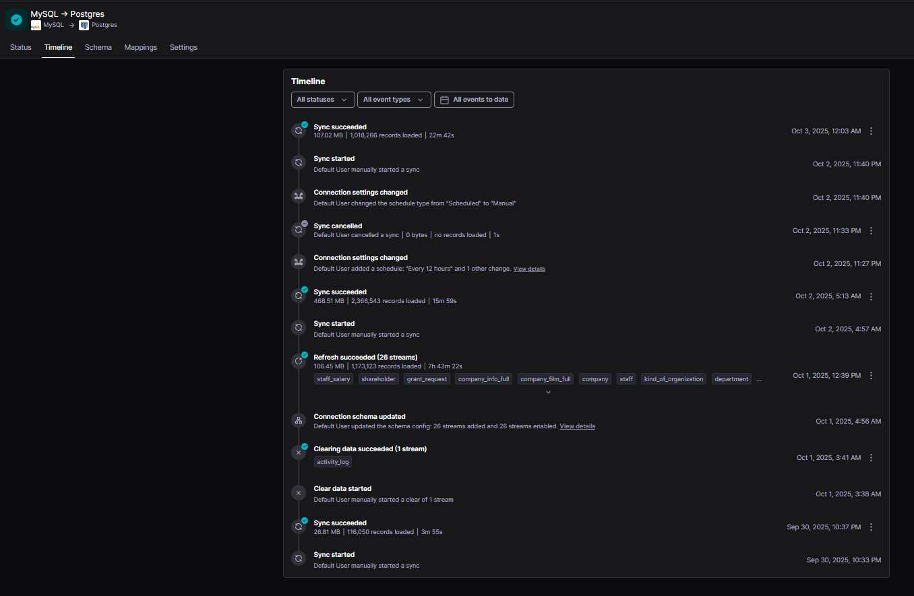
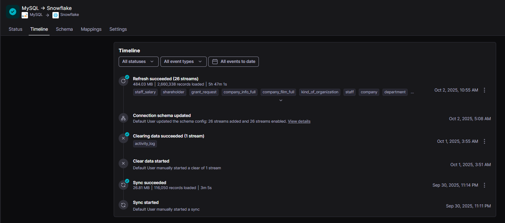
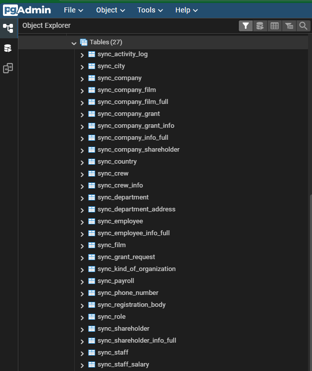
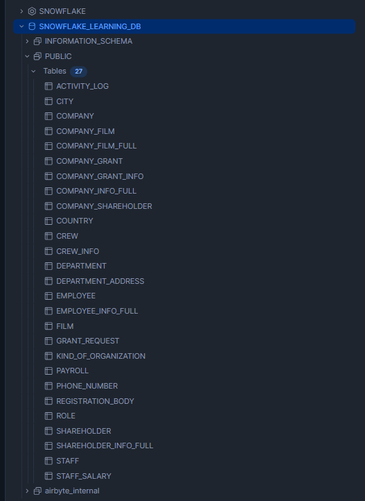

# End-to-End Data Synchronization Pipeline 📡
## Overview 

Business Problem / Scenario

A growing organization needed to unify operational data scattered across multiple systems—transactional records in MySQL, local reporting databases in PostgreSQL, and analytical workloads running in Snowflake. The lack of a synchronized, consolidated data flow caused inconsistencies between teams, delayed reporting, and made it difficult to build a single source of truth for analytics. The company required an automated, reliable, and reproducible mechanism to continuously move data from the operational system into both their local environment and cloud data warehouse.

I designed and built an end-to-end data synchronization pipeline leveraging Airbyte as the integration layer, running the entire infrastructure through Docker for portability and consistency. I configured MySQL as the source and set up PostgreSQL and Snowflake as destinations, establishing Airbyte connections that continuously synchronized the Film dataset across systems. I validated the pipeline using PgAdmin and Snowflake queries, ensuring schema accuracy and successful incremental loads. This solution demonstrated a scalable approach to cross-system data movement and lays the foundation for future enhancements like dbt transformations, CI/CD automation, and expansion to additional data sources.

#### Key Highlights 

- Extracting data from MySQL (Source Database)

- Synchronizing it into PostgreSQL (Local Destination)

- Pushing the same data into Snowflake (Cloud Data Warehouse)

- Using Airbyte as the orchestration layer for data synchronization

- Running the infrastructure inside Docker for reproducibility and isolation

This project shows how these tools come together to handle data movement in a scalable and production-ready way.

## Tech Stack

- MySQL → Source database containing the original data

- PostgreSQL → Local destination database for synchronized data

- Snowflake → Cloud destination database for advanced analytics

- Airbyte → Open-source data integration tool, used to sync data between source and destinations

- Docker → Containerization platform to run MySQL, PostgreSQL, and Airbyte locally

## Setup
1. [Setup  Airbyte on Docker](https://docs.airbyte.com/platform/using-airbyte/getting-started/oss-quickstart#part-1-install-docker-desktop)

2. Run the [Docker compose file](https://github.com/chik0di/cde-bootcamp/blob/main/eu-db-migration/compose.yaml) to start both the `MySQL` source with the Film dataset already loaded, and the `postgres` destination
```
docker compose up -d
```

3. Access Airbyte UI

      - Open http://localhost:8000
 in your browser.

4. Configure Sources and Destinations

      - Add MySQL as a source (via mysql-src container).

      - Add Postgres as a destination (via postgres-dest container).

      - Add Snowflake as a destination (directly connecting to Snowflake Cloud).

5. Run Syncs

      - Define a connection in Airbyte from MySQL → PostgreSQL.

      - Define another connection from MySQL → Snowflake.

      - Trigger a manual sync or schedule automatic syncs.

6. Run PgAdmin to easily and visually verify and query the postgres database. (Optional)
```
docker run -d --name pgadmin --network airbyte-network -e PGADMIN_DEFAULT_EMAIL=admin@admin.com -e PGADMIN_DEFAULT_PASSWORD=admin -p 5050:80 dpage/pgadmin4
```

## Verification

To confirm the syncs:

- Inspect the `Status` and `Timeline` columns on your airbyte connections to monitor activities around schema sync.






- Inspect the Destination databases.




This verifies that data has been successfully moved from MySQL → PostgreSQL and MySQL → Snowflake.


## Future Improvements

- Add dbt transformations on top of synced data for analytics-ready models.

- Automate deployments with CI/CD.

- Extend to additional sources/destinations.

- Experiment with Airbyte Cloud for production environments.