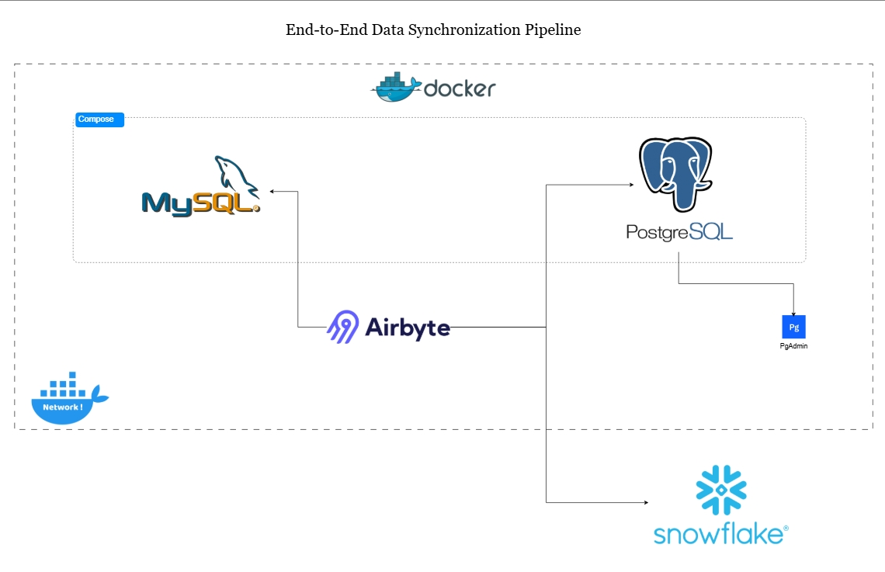

# End-to-End Data Synchronization Pipeline 📡
## Foreword

It began with the promise of something simple: run a few containers, open a browser, and let Airbyte bridge the gap between source and destination. But what should have been a straight line quickly twisted into a labyrinth. I found myself staring into walls of stack traces, Micronaut beans collapsing under the weight of missing keys, connections dying in silence with a blunt Recv failure: Connection reset by peer. Docker logs became my scripture, each line a riddle. Ports were mapped yet unreachable, services alive yet not listening, as if the very heart of Airbyte pulsed behind glass I could not break.

I wrestled with shadows; Segment tracking demanding a key I never had, environment variables turning against me like mischievous doubles, servers waiting endlessly for namespaces that never came. One moment, I ran back to Airbyte Cloud to follow the SSH route but I knew I didn't know what I was doing, the local route was a much bearable frustration; the webapp curled into itself, refusing to answer on 8000. Every fix carried me forward just enough to discover a new kind of failure, until frustration felt like part of the design.

And yet, in the haze of debugging and second-guessing, the answer had been sitting quietly where it always had been: the [documentation](https://docs.airbyte.com/). The [steps to setting up Airbyte on Docker](https://docs.airbyte.com/platform/using-airbyte/getting-started/oss-quickstart#part-1-install-docker-desktop) laid out in plain sight. And suddenly, it worked. The noise fell away, the UI opened, and the thing I had been fighting so hard to force into life simply breathed on its own.

## Overview 

This project demonstrates how to build a complete data synchronization pipeline using Airbyte, MySQL, PostgreSQL, and Snowflake. The goal is to reliably move and synchronize data across multiple systems, while leveraging containerization for easy setup and reproducibility.

Data lives in different systems, but teams need it consolidated for analytics, reporting, or further transformations. This pipeline solves that problem by:

- Extracting data from MySQL (Source Database)

- Synchronizing it into PostgreSQL (Local Destination)

- Pushing the same data into Snowflake (Cloud Data Warehouse)

- Using Airbyte as the orchestration layer for data synchronization

- Running the infrastructure inside Docker for reproducibility and isolation

This project shows how these tools come together to handle data movement in a scalable and production-ready way.

## Tech Stack

- MySQL → Source database containing the original data

- PostgreSQL → Local destination database for synchronized data

- Snowflake → Cloud destination database for advanced analytics

- Airbyte → Open-source data integration tool, used to sync data between source and destinations

- Docker → Containerization platform to run MySQL, PostgreSQL, and Airbyte locally

## Setup
1. [Setup Airbyte on Docker](https://docs.airbyte.com/platform/using-airbyte/getting-started/oss-quickstart#part-1-install-docker-desktop)

2. Run the [Docker compose file](https://github.com/chik0di/cde-bootcamp/blob/main/eu-db-migration/compose.yaml) to start both the `MySQL` source with the Film dataset already loaded, and the `postgres` destination
```
docker compose up -d
```

3. Access Airbyte UI

      - Open http://localhost:8000
 in your browser.

4. Configure Sources and Destinations

      - Add MySQL as a source (via mysql-src container).

      - Add Postgres as a destination (via postgres-dest container).

      - Add Snowflake as a destination (directly connecting to Snowflake Cloud).

5. Run Syncs

      - Define a connection in Airbyte from MySQL → PostgreSQL.

      - Define another connection from MySQL → Snowflake.

      - Trigger a manual sync or schedule automatic syncs.

6. Run PgAdmin to easily and visually verify and query the postgres database. (Optional)
```
docker run -d --name pgadmin --network airbyte-network -e PGADMIN_DEFAULT_EMAIL=admin@admin.com -e PGADMIN_DEFAULT_PASSWORD=admin -p 5050:80 dpage/pgadmin4
```

## Verification

To confirm the syncs:

- Inspect the `Status` and `Timeline` columns on your airbyte connections to monitor activities around schema sync.


- Inspect the Destination databases.


This verifies that data has been successfully moved from MySQL → PostgreSQL and MySQL → Snowflake.

## Architecture



## Future Improvements

- Add dbt transformations on top of synced data for analytics-ready models.

- Automate deployments with CI/CD.

- Extend to additional sources/destinations.

- Experiment with Airbyte Cloud for production environments.